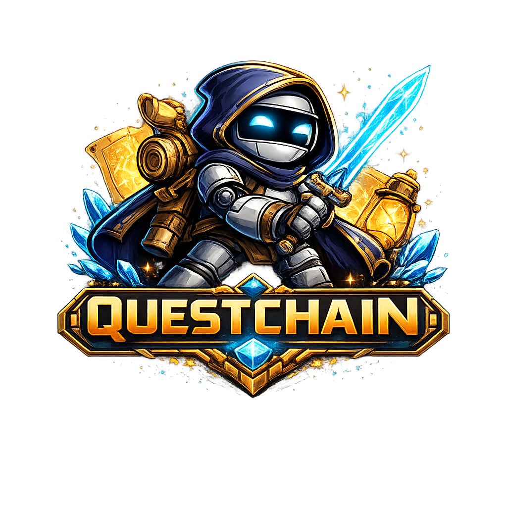

<div align="center">



### Small but mighty. Send your hardware on a quest.

[](https://python.org)
[](https://ollama.com)
[]()
[]()
[]()

</div>

---

## Built for the Edge

Most AI agent frameworks are designed around cloud inference — they assume fast APIs, abundant context windows, and predictable latency. QuestChain is built for the opposite: **consumer GPUs, local models, and constrained hardware.**

The engine is a custom Python async loop — no agent framework, no middleware stack. Just the Ollama Python client, `asyncio`, and a tight streaming loop written specifically to get the most out of small local models.

> *"All the power of AI, none of the cloud bills."*

**How it's optimized for edge hardware:**

- **No framework overhead.** The entire agent loop is ~100 lines of plain Python. Stream from Ollama, detect tool calls, execute, loop. No graph execution engines, no serialization layers, nothing between the model and your hardware.

- **Streaming from the first token.** Text tokens are yielded to the UI as they arrive from Ollama. You see output immediately — critical when you can't afford the latency of waiting for a full response before rendering.

- **`<think>` filtering on the stream.** Reasoning models like DeepSeek-R1 and Qwen3 emit `<think>…</think>` blocks before their actual response. QuestChain strips them using a character-level state machine *as the stream arrives* — they never reach the context buffer, never consume your token budget, and never appear in the UI.

- **Per-model context tuning.** Each model preset specifies its own `num_ctx`, `num_predict`, and `temperature`. You're not running an 8B model with a 128k context window it can't fill — context is sized to match the model's actual capacity.

- **Direct GPU and CPU control.** `OLLAMA_NUM_GPU` and `OLLAMA_NUM_THREAD` pass through directly to Ollama's inference options. Pin layers to GPU, pin thread count — no abstraction layer in the way.

- **Approximate token counting, no tokenizer API.** Budget tracking uses `chars / 4` — a fast local approximation with no round-trip to the model. Context compaction triggers automatically before the window fills up.

- **Auto-compaction via the model itself.** When context gets tight, QuestChain keeps the 6 most recent messages and uses the model to summarise everything older into a single block. The summary replaces the raw history in the JSONL file — reclaiming space while preserving what matters.

- **Lazy skill loading.** Each skill contributes only its name and a one-line description to the system prompt (~24 tokens). The full skill content is only fetched into context when the agent explicitly calls `read_skill(name)`. A large skill library costs almost nothing at inference time.

- **Short system prompt by design.** The base system prompt is ~550 characters. Every token in the system prompt is repeated across every turn — keeping it small has a compounding effect on memory and speed over long sessions.

- **Parallel tool execution.** When the model issues multiple tool calls in one turn, they run concurrently via `asyncio.gather`. File reads, web searches, and shell commands that don't depend on each other don't wait in line.

- **Plain JSONL history, no database.** Conversation history is stored as one JSON object per line in `~/.questchain/sessions/`. Human-readable, zero-dependency, trivially debuggable.

---

## It Codes Itself

<p align="center"></p>

QuestChain has a `claude_code` tool that delegates programming tasks to Claude Code — Anthropic's AI coding agent running locally in your terminal. QuestChain uses this tool to develop its own codebase.

When QuestChain identifies a bug, wants a new feature, or needs to refactor something, it can hand off a coding task to Claude Code with full filesystem access, then review the result. This has already happened: features in QuestChain's codebase were written by QuestChain itself, using Claude Code as its hands.

This creates a feedback loop where the agent's own capabilities improve over time — without you writing a line of code.

```
  You: "add a command that summarizes my TASKS.md"
     ↓
  QuestChain reasons about what needs to change
     ↓
  Calls claude_code("add /summary command to cli.py that reads TASKS.md...")
     ↓
  Claude Code edits the files, runs tests, commits
     ↓
  QuestChain reviews the result and reports back
```

---

## The Night Owl

<p align="center"></p>

Switch to the **Night Owl** agent and it works while you sleep. Every 30 minutes between midnight and 6 AM, it reads your `overnight.md` task file and gets to work — researching topics, writing reports, running code — then logs what it did before going quiet.

When you first activate the Night Owl, it walks you through a short setup: what topics to research each night, what standing tasks to prepare for you each morning, and anything else you want done in the background. It generates a structured `overnight.md` from your answers and runs from it every night.

Add one-off tasks at any time with `/overnight` — type the command, enter your task, and it gets queued for tonight.

---

## Why QuestChain?

Most AI assistants send your conversations to the cloud, charge per token, and forget everything the moment you close the tab. QuestChain is different.

QuestChain runs entirely on your own hardware using [Ollama](https://ollama.com). Your data never leaves your machine. No API bills, no rate limits, no terms-of-service watching your messages. It works offline. It's yours.

And it's not a chatbot. QuestChain is a full **agentic loop** — it can search the web, read and write files, execute shell commands, schedule recurring tasks, send you Telegram messages, and work autonomously in the background while you focus on something else.

---

## RPG Progression

Every agent levels up from use. The more it works, the stronger it gets — and you can see it in real time.

- **XP per turn** — tool calls, response length, and completed tasks all earn XP
- **20 levels** — each ~1.6× harder than the last
- **20 achievements** — First Strike, Polymath, Speed Demon, Legend, and more
- **6 agent classes** — each with a preset tool loadout and its own identity

```
──────────── Aria · Lv.3 🔭 Scout ────────────
❯ find the latest papers on in-context learning

Aria  Lv.3
  > Using tool: web_search
  > Using tool: web_browse
...
⚔  LEVEL UP — Level 4  ·  🔭 Scout
  ✦ Achievement unlocked: Bibliophile — Read 50 files
```

Use `/stats` to see your agent's XP bar, top tools, and achievement history. Use `/agents` to switch between agents — each tracks its own progression independently.

### Classes

| Class | Icon | Tool Preset |
|---|---|---|
| Custom | 🌀 | You configure |
| Sage | 📚 | Built-in tools only |
| Explorer | 🔭 | Web search + browse |
| Architect | ⚒️ | Claude Code |
| Oracle | 🔮 | Web search |
| Sentinel | ⏱️ | Cron scheduler |
| Night Owl | 🌙 | Web search + browse + Claude Code |

---

## Local vs. Cloud

| | QuestChain | Cloud AI |
|---|---|---|
| **Your data** | Stays on your machine | Sent to third-party servers |
| **Cost** | $0 after hardware | $/token or subscription |
| **Works offline** | ✅ | ❌ |
| **File & shell access** | Full, real filesystem | Sandboxed or unavailable |
| **Memory** | Persistent across sessions | Usually resets every chat |
| **Autonomous tasks** | Background busy work loop | Manual only |
| **Remote access** | Built-in Telegram bot | Separate product |
| **Model choice** | Any Ollama model | Locked to provider |
| **Self-improvement** | Codes its own codebase | ❌ |

---

## What It Can Do

- 🔍 **Web Search & Browse** — Find current information and extract full page content via Tavily
- 📁 **File Operations** — Read, write, edit, list, search files on your real filesystem
- 💻 **Shell Commands** — Run terminal commands and scripts directly
- 🧠 **Planning** — Break down complex tasks into steps with built-in todo tools
- 🖥️ **Self-Coding** — Delegate programming tasks to Claude Code; modify its own codebase
- ⏰ **Cron Jobs** — Schedule recurring tasks that run automatically and report back
- 📱 **Telegram Bot** — Access QuestChain remotely from your phone
- 💾 **Persistent Memory** — Learns your preferences and saves notes across sessions
- 🗣️ **Voice Output** — Speak responses aloud via Kokoro TTS (CLI) or Telegram voice messages
- 🔄 **Busy Work** — Autonomously checks your task list and works in the background on a timer
- 🧩 **Skills** — Extend the agent with Markdown skill files it can load on demand

---

## How It Works

```
                     ┌─────────────────────────────────────┐
      You type       │            QuestChain                │
  ────────────────▶  │                                      │
  (CLI or Telegram)  │  ┌─────────────────────────────┐    │
                     │  │   Custom Python Agent Engine │    │
                     │  │                             │    │    ┌─────────────┐
                     │  │  stream → tools → stream    │◀───┼───▶│   Ollama    │
                     │  │  (async, parallel tools)    │    │    │  (on-device)│
                     │  └──────────────┬──────────────┘    │    └─────────────┘
                     │                 │                    │
                     │        ┌────────┴────────┐           │
                     │        ▼                 ▼           │
                     │   ┌─────────┐     ┌──────────────┐  │
                     │   │  Tools  │     │   Context    │  │
                     │   │         │     │              │  │
                     │   │ • files │     │ JSONL history│  │
                     │   │ • shell │     │ token budget │  │
                     │   │ • web   │     │ compaction   │  │
                     │   │ • cron  │     └──────────────┘  │
                     │   │ • claude│                        │
                     │   │   _code │                        │
                     │   └─────────┘                        │
                     └─────────────────────────────────────┘
```

The engine streams tokens from Ollama, detects tool calls in the final chunk, executes them concurrently via `asyncio.gather`, appends results to the JSONL history, and loops — up to 30 iterations. When the context window fills up, old turns are summarised by the model and replaced in place. The loop exits when the model responds with text and no tool calls.

---

## Install

One command. The installer handles everything: Ollama, Python, uv, QuestChain, and the default model.

**Windows** — open PowerShell and run:

```powershell
powershell -ExecutionPolicy Bypass -c "irm https://raw.githubusercontent.com/RayP11/QuestChain/main/install.ps1 | iex"
```

**macOS / Linux** — open a terminal and run:

```bash
curl -fsSL https://raw.githubusercontent.com/RayP11/QuestChain/main/install.sh | bash
```

> **macOS note:** Ollama is installed via [Homebrew](https://brew.sh). If you don't have Homebrew, install it first or download Ollama manually from [ollama.com](https://ollama.com/download).

What gets installed:
- **Ollama** — local LLM runtime
- **Python 3.13** — if not already installed (Windows only; uv manages Python on Mac/Linux)
- **uv** — fast Python package manager
- **QuestChain** — installed and added to PATH
- **qwen3:8b** — default model pulled and ready

Takes ~5–10 minutes depending on your internet speed (the model download is the slow part).

Then run:

```
questchain start
```

On first run, QuestChain walks you through a short onboarding conversation and optionally sets up Telegram. After that, it remembers who you are.

> **Web search (optional):** Run `/tavily` inside QuestChain to set up your free [Tavily API key](https://tavily.com) and enable web search and browsing.

---

## Usage

```bash
# Start QuestChain
questchain start

# Use a specific model
questchain start -m qwen2.5:14b-instruct

# Resume a previous conversation by thread ID
questchain start -t <thread-id>

# Run without persistent memory
questchain start --no-memory

# Set the busy work interval (minutes)
questchain start --busy-work 30

# Disable background busy work
questchain start --no-busy-work

# List available model presets
questchain start --list-models
```

---

## Terminal Commands

| Command | Description |
|---|---|
| `/help` | Show all available commands |
| `/new` | Start a fresh conversation |
| `/model` | Show current model and list available ones |
| `/thread` | Show current conversation thread ID |
| `/busy` | Show busy work scheduler status |
| `/tools` | List all available agent tools |
| `/instructions` | Show the agent's system prompt |
| `/memory` | Show your saved user profile |
| `/tasks` | Show the current workspace task list |
| `/cron` | List scheduled cron jobs |
| `/agents` | Manage agent profiles (list, switch, create, edit) |
| `/stats` | Show agent level, XP bar, top tools, and achievements |
| `/onboard` | Re-run the onboarding conversation |
| `/tavily` | Set up Tavily web search API key |
| `/telegram` | Set up Telegram bot credentials |
| `/clear` | Clear the screen |
| **Ctrl+D** | Exit QuestChain |

---

## Telegram Setup

QuestChain runs alongside the CLI as a Telegram bot, giving you remote access from your phone.

Run `/telegram` inside QuestChain and it walks you through the setup:

1. Message [@BotFather](https://t.me/botfather) on Telegram → `/newbot` → copy the token
2. Message [@userinfobot](https://t.me/userinfobot) → copy your numeric user ID
3. Paste both into the `/telegram` wizard — credentials are saved automatically

Restart QuestChain and the bot starts alongside the CLI. The same conversation thread and memory is shared between CLI and Telegram — switch between them mid-conversation.

---

## Busy Work

QuestChain can work autonomously in the background on a timer. Drop tasks into `workspace/TASKS.md`:

```markdown
- [ ] Research the latest news on quantum computing and summarize key developments
- [ ] Check if any of my Python packages have available updates
- [ ] Draft a weekly status email based on my recent work
```

QuestChain picks up one task per tick, completes it using all its tools, marks it done, and sends you a summary — in the terminal and on Telegram if configured.

```bash
# Run with a 30-minute busy work interval
questchain start --busy-work 30
```

---

## Configuration

All settings via environment variables or a `.env` file in the project root:

| Variable | Default | Description |
|---|---|---|
| `OLLAMA_MODEL` | `qwen3:8b` | Default model to use |
| `OLLAMA_BASE_URL` | `http://localhost:11434` | Ollama server URL |
| `OLLAMA_NUM_GPU` | *(auto)* | GPU layers to offload (`-1` = all) |
| `OLLAMA_NUM_THREAD` | *(auto)* | CPU threads for inference |
| `TAVILY_API_KEY` | — | Web search API key (free tier at tavily.com) |
| `TELEGRAM_BOT_TOKEN` | — | Telegram bot token |
| `TELEGRAM_OWNER_ID` | — | Your Telegram user ID (access control) |
| `QUESTCHAIN_DATA_DIR` | `~/.questchain` | Session history, cron jobs |
| `QUESTCHAIN_WORKSPACE_DIR` | Project root | Workspace and memory root |

---

## Model Presets

Any Ollama model works. These are pre-tuned for the best agentic experience on edge hardware:

| Model | VRAM | Notes |
|---|---|---|
| `qwen3:8b` | ~6 GB | **Default** — Fast, excellent tool calling, native thinking |
| `qwen2.5:7b-instruct` | ~6 GB | Top-tier tool calling |
| `qwen2.5:14b-instruct` | ~10 GB | More capable |
| `llama3.1:8b-instruct` | ~6 GB | Strong tool calling (BFCL 77-81%) |
| `llama3.3:8b-instruct` | ~6 GB | Newer Llama, strong tool use |
| `mistral:7b` | ~5 GB | Fast, low resource |
| `mistral-nemo:12b` | ~8 GB | Stronger Mistral variant |
| `dolphin3:latest` | ~6 GB | Uncensored, good for agents |
| `deepseek-r1:7b` | ~6 GB | Strong reasoning, `<think>` filtered automatically |
| `deepseek-r1:14b` | ~10 GB | Stronger reasoning |
| `deepseek-coder-v2:16b` | ~12 GB | Best local code generation |

```bash
questchain start --list-models   # see all presets with descriptions
questchain start -m <any-model>  # use any model installed in Ollama
```

---

## Project Structure

```
(project root)/
├── questchain/
│   ├── __main__.py         Entry point
│   ├── cli.py              Terminal UI and REPL loop
│   ├── agent.py            Agent factory — wires engine together
│   ├── agents.py           Agent profiles — classes, presets, persistence
│   ├── progression.py      XP, levels, achievements per agent
│   ├── config.py           Settings, model presets, paths
│   ├── telegram.py         Telegram bot adapter
│   ├── scheduler.py        Cron job runner
│   ├── busy_work.py        Background autonomous work loop
│   ├── onboarding.py       First-run onboarding flow
│   ├── engine/             Custom Python async agent runtime
│   │   ├── agent.py        Core stream→tools→stream loop
│   │   ├── model.py        OllamaModel: streaming + <think> filtering
│   │   ├── tools.py        ToolRegistry, @tool decorator, parallel exec
│   │   ├── context.py      JSONL history, token budget, compaction
│   │   ├── skills.py       Lazy skill loader
│   │   └── builtins/       filesystem, shell, planning tools
│   ├── tools/
│   │   ├── web_search.py   Tavily search
│   │   ├── web_browse.py   Tavily page extract
│   │   ├── claude_code.py  Delegate coding tasks to Claude Code
│   │   ├── cron.py         Cron management tools
│   │   └── speak.py        Kokoro TTS voice output
│   └── memory/
│       └── store.py        Thread history shim
├── skills/                 Agent skill definitions (Markdown)
└── workspace/
    ├── TASKS.md            Drop tasks here for busy work
    └── memory/
        ├── ABOUT.md        Your profile (written during onboarding)
        └── AGENTS.md       Agent's own persistent notes
```

---

## Built With

<div align="center">

[](https://ollama.com)
[](https://tavily.com)
[](https://claude.ai/code)
[](https://core.telegram.org/bots)
[](https://github.com/Textualize/rich)

</div>

- **Custom async agent engine** — purpose-built for edge AI; lightweight, streaming, parallel tool execution
- **[Ollama](https://ollama.com)** — Run any open-weight LLM locally with one command
- **[Claude Code](https://claude.ai/code)** — Anthropic's coding agent; QuestChain delegates programming tasks to it
- **[Tavily](https://tavily.com)** — Web search and full-page extraction API
- **[python-telegram-bot](https://python-telegram-bot.org)** — Telegram bot SDK
- **[APScheduler](https://apscheduler.readthedocs.io)** — Async cron job scheduling
- **[Kokoro ONNX](https://github.com/thewh1teagle/kokoro-onnx)** — Fast local text-to-speech
- **[Rich](https://github.com/Textualize/rich)** — Beautiful terminal output
- **[prompt-toolkit](https://python-prompt-toolkit.readthedocs.io)** — Interactive terminal input with history

---

<div align="center">
<sub>No cloud. No cost. No compromise. Small but mighty — send your hardware on a quest.</sub>
</div>
