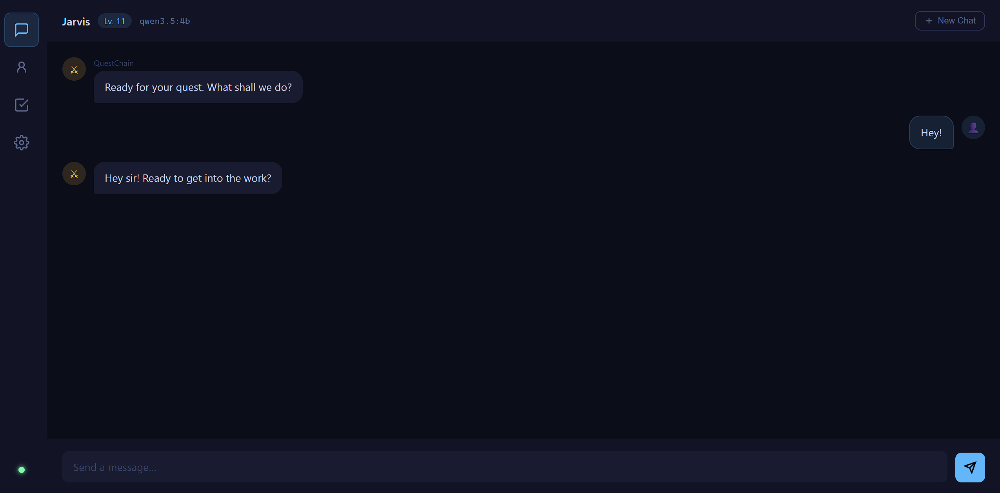
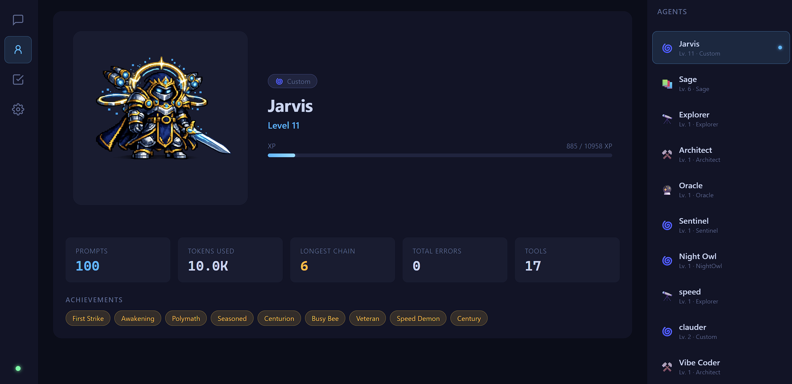

<div align="center">


# Truly Local. Always On. Ready for Quests.

### Your AI assistant, running on your hardware, working for you around the clock.

[](https://github.com/RayP11/QuestChain/stargazers)

[](https://python.org)
[](https://ollama.com)
[](https://github.com/RayP11/QuestChain/blob/master/LICENSE)

[](https://discord.gg/C8Rc3u7KKx)




</div>

---

QuestChain is an AI assistant that runs entirely on your machine. No cloud, no subscriptions, no usage limits — just your hardware running a capable local model 24/7. It reads your files, runs shell commands, searches the web, schedules jobs, and works through your task list while you sleep. Nothing leaves your machine.

---

## Contents

- [Why QuestChain?](#why-questchain)
- [RPG Progression](#rpg-progression)
- [Quests](#quests)
- [Install](#install)
- [What It Can Do](#what-it-can-do)
- [Built for the Edge — Securely](#built-for-the-edge--securely)
- [It Codes Itself](#it-codes-itself)
- [Usage](#usage)
- [Terminal Commands](#terminal-commands)
- [Telegram Setup](#telegram-setup)
- [Configuration](#configuration)
- [Model Presets](#model-presets)
- [Contributing](#contributing)
- [Built With](#built-with)

---

## Why QuestChain?

I tried [OpenClaw](https://github.com/OpenClaw-AI/OpenClaw) and was having a lot of fun playing around with it. However, I couldn't afford the api token cost and I wasn't able to run local models quickly without having to buy even more expensive hardware. So I was inspired to create a framework which could run models as small as 3B autonomously and productively. 

QuestChain is that framework: a party of micro agents all jam-packed with tool loadouts for specific tasks, fully autonomous, and with a twist of gamification.

### How it compares

| | **QuestChain** | **[picoClaw](https://github.com/sipeed/picoclaw)** | **[OpenClaw](https://github.com/OpenClaw-AI/OpenClaw)** |
|---|---|---|---|
| Language | Python | Go | TypeScript |
| Lines of code | ~10,600 | ~87,000 | ~1,250,000 |
| Source files | 38 | 583 | 8,085 |
| Multi-surface (CLI, Telegram, Web) | ✅ | ✅ | ✅ |
| RPG progression | ✅ | ❌ | ❌ |

QuestChain is ~8× smaller than picoClaw and ~118× smaller than OpenClaw, while covering multi-surface chat, RPG progression, cron scheduling, and a custom async agent engine — all in pure Python.

---

## RPG Progression

<div align="center">

</div>

QuestChain isn't just a tool. It's a companion you build over time. Every agent starts at Level 1 and earns XP through real work: tool calls, completed tasks, background jobs, and extended conversations. The more your agent works, the stronger it gets.

Each agent has:

- Levels (1-20)
- A class
- Achievements
- Progression
- Behavior
- Tools

### Classes

Pick a class when creating an agent. It sets the tool loadout, identity, and specialty. Each class tracks its own progression independently.

| Class | Icon | Specialty | Tool Preset |
|---|---|---|---|
| Custom | 🌀 | You decide | You configure |
| Sage | 📚 | Files & knowledge | File tools |
| Explorer | 🔭 | Research & discovery | Web search + browse |
| Architect | ⚒️ | Code & systems | Files, shell, Claude Code |
| Oracle | 🔮 | Planning & strategy | File tools |
| Scheduler | ⏱️ | Automation | Cron only |

---

## Quests

<div align="center">

</div>

QuestChain can work autonomously in the background on a timer. Every 60 minutes (configurable), it picks the first quest from `workspace/quests/` and completes it. If no quests are pending, it stays silent.

**Quests** are individual `.md` files in `workspace/quests/` — one file per task. Write whatever you want the agent to do:

```markdown
# workspace/quests/find-api-docs.md
Find the REST API docs for the weather service and save a summary to /workspace/memory/weather-api.md
```

The agent reads the quest, uses all the tools at its disposal to complete the task, then deletes the file automatically. Results are shown in the terminal and on Telegram if configured.

Use `/quest` to open the interactive quest manager — create, view, and delete quests with arrow keys:

```
 Quests   [n] new  [d] delete  [Esc] close
 ──────────────────────────────────────────
 ▶ find-api-docs.md
   refactor-auth-module.md
```

```bash
# Run with a custom interval (minutes)
questchain start --quests 30

# Disable the quest runner
questchain start --no-quests
```

---

## Install

### Step 1: Install Ollama

Download and install Ollama from [ollama.com/download](https://ollama.com/download), then start it:

```bash
ollama serve
```

Leave it running, then open a new terminal for the next step.

### Step 2: Install QuestChain

**Windows:** open PowerShell and run:

```powershell
powershell -ExecutionPolicy Bypass -c "irm https://raw.githubusercontent.com/RayP11/QuestChain/main/install.ps1 | iex"
```

**macOS / Linux:** open a terminal and run:

```bash
curl -fsSL https://raw.githubusercontent.com/RayP11/QuestChain/main/install.sh | bash
```

### Step 3: Run

```
questchain start
```

On first run, QuestChain walks you through a short onboarding conversation and optionally sets up Telegram. After that, it remembers who you are.

> **Web search (optional):** Run `/tavily` inside QuestChain to set up your free [Tavily API key](https://tavily.com) and enable web search and browsing.

### Startup Cheat Sheet

```bash
questchain start                      # Start with default model
questchain start -m qwen3:4b          # Use a specific model
questchain start -t <thread-id>       # Resume a previous conversation
questchain start --no-memory          # Run without persistent memory
questchain start --quests 30          # Set quest runner interval (minutes)
questchain start --no-quests          # Disable the quest runner
questchain start --web                # Start with web UI (gateway + CLI)
questchain start --web-only           # Start web UI only (no CLI)
questchain start --list-models        # Show available model presets
```

### Clone & Run (alternative)

If you want to clone the repo directly, modify the code, or run from source:

```bash
git clone https://github.com/RayP11/QuestChain.git
cd QuestChain
pip install -e .
```

Then run:

```bash
python -m questchain
```

If you have [uv](https://docs.astral.sh/uv/) installed, you can use that instead of pip:

```bash
uv pip install -e .
python -m questchain
```

> Ollama must still be running before starting QuestChain. See Step 1 above.

---

## What It Can Do

- 🔍 **Web Search & Browse** — Find current information and extract full page content via Tavily *(optional)*
- 📁 **File Operations** — Read, write, edit, list, search files on your real filesystem
- 💻 **Shell Commands** — Run terminal commands and scripts directly
- 🖥️ **Self-Coding** — Delegate programming tasks to Claude Code; modify its own codebase *(optional)*
- ⏰ **Cron Jobs** — Schedule recurring tasks that run automatically and report back
- 📱 **Telegram Bot** — Access QuestChain remotely from your phone
- 💾 **Persistent Memory** — Learns your preferences and saves notes across sessions
- 🗣️ **Voice Output** — Speak responses aloud via Kokoro TTS (CLI) or Telegram voice messages
- 🔄 **Quests** — Autonomously checks your task list and works in the background on a timer

---

## Built for the Edge — Securely

Most AI tools assume cloud infrastructure and always-online connections. QuestChain runs on the hardware you already own — reliably on models as small as **3B parameters** — and is built so that nothing has to leave your machine.

> *"All the power of AI, none of the cloud bills."*

**Performance on constrained hardware:**
- **No bloat.** The entire agent loop is ~100 lines of Python — no framework overhead, nothing between the model and your machine.
- **Context is managed automatically.** When memory fills up, QuestChain summarizes older conversation and keeps going — no crashes, no cutoffs.
- **Tools run in parallel.** Web search, file reads, and shell commands execute simultaneously when needed.

**Private by design:**
- **Nothing reachable from outside** — runs only on your computer, never exposed to the internet.
- **No store, no strangers' code** — No online marketplace, no telemetry, nothing phoning home.
- **No accounts, nothing to steal** — Optional API keys stay in a local file and go nowhere else.
- **Works with no internet at all** — Disconnect your machine and QuestChain keeps working.

Want to go further? Two optional integrations are a single command away: [Tavily](https://tavily.com) for live web search, and [Claude Code](https://claude.ai/code) for delegating coding tasks. Both are opt-in and only activate when you call them.

---

## It Ships

<div align="center">

</div>

QuestChain can delegate programming tasks to [Claude Code](https://claude.ai/code) (Anthropic's coding agent) with full access to your filesystem. It uses this to develop its own codebase: describe a bug or feature, and QuestChain hands it off, reviews the result, and reports back.

My own QuestChain agent Jarvis has actually started vibing its own features and pushing code to this repo.

> **No Claude Code?** Try running a local coder model instead. Try `deepseek-coder-v2:16b` for maximum capability, or `qwen2.5-coder:7b` for a lighter option.

---

## Usage

```bash
# Start QuestChain
questchain start

# Use a specific model
questchain start -m qwen3:4b

# Resume a previous conversation by thread ID
questchain start -t <thread-id>

# Run without persistent memory
questchain start --no-memory

# Set the quest runner interval (minutes)
questchain start --quests 30

# Disable the quest runner
questchain start --no-quests

# List available model presets
questchain start --list-models
```

---

## Terminal Commands

| Command | Description |
|---|---|
| `/help` | Show all available commands |
| `/new` | Start a fresh conversation |
| `/model` | Show current model and list available ones |
| `/thread` | Show current conversation thread ID |
| `/tools` | List all available agent tools |
| `/instructions` | Show the agent's system prompt |
| `/memory` | Show your saved user profile |
| `/cron` | List scheduled cron jobs |
| `/agents` | Manage agent profiles (list, switch, create, edit) |
| `/stats` | Show agent level, XP bar, top tools, and achievements |
| `/onboard` | Re-run the onboarding conversation |
| `/tavily` | Set up Tavily web search API key |
| `/telegram` | Set up Telegram bot credentials |
| **Ctrl+D** | Exit QuestChain |

---

## Telegram Setup

QuestChain runs alongside the CLI as a Telegram bot, giving you remote access from your phone.

Run `/telegram` inside QuestChain and it walks you through the setup:

1. Message [@BotFather](https://t.me/botfather) on Telegram → `/newbot` → copy the token
2. Message [@userinfobot](https://t.me/userinfobot) → copy your numeric user ID
3. Paste both into the `/telegram` wizard. Credentials are saved automatically.

Restart QuestChain and the bot starts alongside the CLI. The same conversation thread and memory is shared between CLI and Telegram. Switch between them mid-conversation.

---

## Configuration

All settings via environment variables or a `.env` file in the project root:

| Variable | Default | Description |
|---|---|---|
| `OLLAMA_MODEL` | `qwen3:8b` | Default model to use |
| `OLLAMA_BASE_URL` | `http://localhost:11434` | Ollama server URL |
| `OLLAMA_NUM_GPU` | *(auto)* | GPU layers to offload (`-1` = all) |
| `OLLAMA_NUM_THREAD` | *(auto)* | CPU threads for inference |
| `TAVILY_API_KEY` | — | Web search API key (free tier at tavily.com) |
| `TELEGRAM_BOT_TOKEN` | — | Telegram bot token |
| `TELEGRAM_OWNER_ID` | — | Your Telegram user ID (access control) |
| `QUESTCHAIN_DATA_DIR` | `~/.questchain` | Session history, cron jobs |
| `QUESTCHAIN_WORKSPACE_DIR` | Project root | Workspace and memory root |

---

## Model Presets

Any Ollama model works. These are pre-tuned for the best agentic experience on edge hardware:

<details>
<summary>Show all presets</summary>

| Model | VRAM | Notes |
|---|---|---|
| `qwen3:8b` | ~6 GB | **Default** — Fast, excellent tool calling, native thinking |
| `qwen2.5:7b-instruct` | ~6 GB | Top-tier tool calling |
| `qwen2.5:14b-instruct` | ~10 GB | More capable |
| `llama3.1:8b-instruct` | ~6 GB | Strong tool calling (BFCL 77-81%) |
| `llama3.3:8b-instruct` | ~6 GB | Newer Llama, strong tool use |
| `mistral:7b` | ~5 GB | Fast, low resource |
| `mistral-nemo:12b` | ~8 GB | Stronger Mistral variant |
| `dolphin3:latest` | ~6 GB | Uncensored, good for agents |
| `deepseek-r1:7b` | ~6 GB | Strong reasoning, `<think>` filtered automatically |
| `deepseek-r1:14b` | ~10 GB | Stronger reasoning |
| `deepseek-coder-v2:16b` | ~12 GB | Best local code generation |
| `qwen3:4b` | ~3 GB | Compact Qwen3 — solid tool calling, native thinking |
| `qwen3:1.7b` | ~2 GB | Ultra-light Qwen3 — runs on CPU or minimal VRAM |
| `qwen2.5:3b` | ~2.5 GB | Smallest reliable tool-calling model |
| `llama3.2:3b` | ~2.5 GB | Meta's 3B — fast, decent tool use |
| `phi4-mini:3.8b` | ~3 GB | Microsoft Phi-4 Mini — punches above its size |
| `gemma3:4b` | ~3 GB | Google Gemma 3 4B — efficient, good instruction following |

</details>

```bash
questchain start --list-models   # see all presets with descriptions
questchain start -m <any-model>  # use any model installed in Ollama
```

---

## Contributing

Contributions are welcome. Bug reports, feature requests, and pull requests all help.

- **Issues:** [github.com/RayP11/QuestChain/issues](https://github.com/RayP11/QuestChain/issues)
- **Discussion & ideas:** [Join the Discord](https://discord.gg/C8Rc3u7KKx)
- **Self-hosted development:** QuestChain can write and test its own code — see [It Codes Itself](#it-codes-itself)

---

## Built With

<div align="center">

[](https://ollama.com)
[](https://tavily.com)
[](https://claude.ai/code)
[](https://core.telegram.org/bots)
[](https://github.com/Textualize/rich)

</div>

- **Custom async agent engine** — purpose-built for edge AI; lightweight, streaming, parallel tool execution
- **[Ollama](https://ollama.com)** — Run any open-weight LLM locally with one command
- **[Claude Code](https://claude.ai/code)** — Anthropic's coding agent; QuestChain delegates programming tasks to it
- **[Tavily](https://tavily.com)** — Web search and full-page extraction API
- **[python-telegram-bot](https://python-telegram-bot.org)** — Telegram bot SDK
- **[APScheduler](https://apscheduler.readthedocs.io)** — Async cron job scheduling
- **[Kokoro ONNX](https://github.com/thewh1teagle/kokoro-onnx)** — Fast local text-to-speech
- **[Rich](https://github.com/Textualize/rich)** — Beautiful terminal output
- **[prompt-toolkit](https://python-prompt-toolkit.readthedocs.io)** — Interactive terminal input with history

---

<div align="center">
<sub>No cloud. No cost. No compromise. Small but mighty. Send your hardware on a quest.</sub>
<br><br>

### 💬 [Join the QuestChain Discord](https://discord.gg/C8Rc3u7KKx)
**Share agents, get help, and follow development.**

<br>
<sub>If QuestChain is meaningful to you, a ⭐ helps others find it.</sub>
</div>
