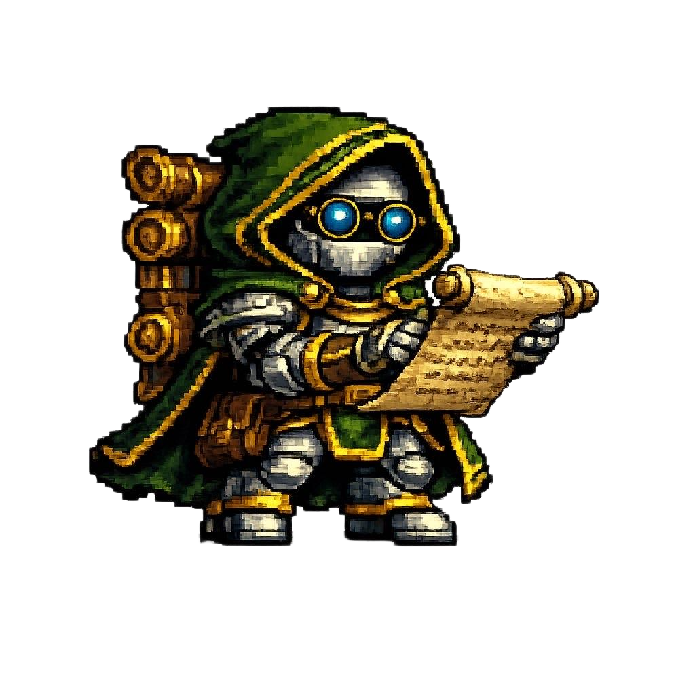

<div align="center"></div>

# Command Guide

## Starting QuestChain

```bash
questchain start --web                  # Start with web UI (recommended)
questchain start --web -m qwen3:4b      # Use a lighter model
questchain start --web --quests 30      # Check for quests every 30 minutes
questchain start --web --no-quests      # Disable background quests
questchain start -t <thread-id>         # Resume a specific conversation
```

Once running, open **[http://127.0.0.1:8765](http://127.0.0.1:8765)** in your browser.

---

## In-app commands

Type these directly in the chat at any time:

| Command | What it does |
|---|---|
| `/help` | Show all available commands |
| `/new` | Start a fresh conversation |
| `/agents` | Switch agents, create a new one, or edit existing ones |
| `/quest` | Open the quest manager — create, view, or delete quests |
| `/stats` | See your agent's level, XP, top tools, and achievements |
| `/memory` | View your saved user profile (what QuestChain knows about you) |
| `/model` | Show the current model and switch to a different one |
| `/tools` | List everything your agent can do |
| `/cron` | See scheduled jobs |
| `/instructions` | View your agent's current personality and rules |
| `/tavily` | Set up web search (free Tavily API key) |
| `/telegram` | Set up Telegram remote access |
| `/onboard` | Re-run the setup conversation |
| `/thread` | Show the current conversation ID |
| **Ctrl+D** | Exit |

---

## Tips

**Switching agents mid-conversation:** Use `/agents` to pick a different agent. Each one has its own focus, tools, and history.

**Resuming a conversation:** Every conversation has a thread ID (shown with `/thread`). Pass it with `-t <id>` at startup to pick up exactly where you left off.

**Changing models on the fly:** Use `/model` to see what's available and switch without restarting.
